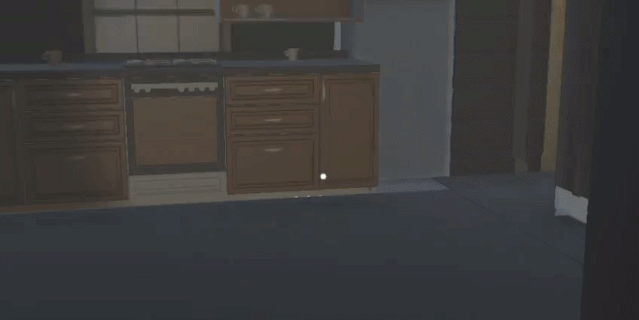

# THE RITUAL
A first-person psychological horror game developed with **Unity** and **C#**.

**Project Type:** Solo Project

**Project Period:** March 2025 – June 2026

---

## Overview

**THE RITUAL** places players inside an abandoned house with no memory of how they arrived. Players explore the environment, solve puzzles, search for clues, and uncover the truth behind a forgotten ritual while avoiding an unseen threat.

The game combines exploration, environmental storytelling, puzzle-solving, and atmospheric design to create a tense horror experience.

---

## Features

* First-person horror gameplay
* Interactive exploration
* Environmental puzzles
* Inventory and item collection system
* Monster AI and chase mechanics
* Interactive objects
* Atmospheric lighting and sound design
* Story-driven progression

---

## Built With

* Unity
* C#
* Visual Studio
* Unity Input System

---

## My Role

Covering the complete development process from concept to release.

### Responsibilities

* Designed and implemented gameplay systems using Unity and C#
* Developed player interaction and exploration mechanics
* Created puzzle systems and progression logic
* Implemented inventory and item collection features
* Built and designed game environments
* Integrated 3D assets, materials, audio, and UI
* Tested, debugged, and optimized gameplay
* Published the game on itch.io and incorporated player feedback into later improvements

---

## Skills Demonstrated

* Unity Game Development
* C#
* Gameplay Programming
* Game Design
* Level Design
* AI Programming
* UI Implementation
* Audio Integration
* Debugging & Optimization
* Project Management

---

## Play the Game

Play **THE RITUAL** on itch.io:

https://klotdevs.itch.io/the-ritual

---

## Repository

This repository contains the Unity project source code for **THE RITUAL**.

Generated Unity folders such as `Library`, `Temp`, and `Logs` are excluded from version control using `.gitignore`.
